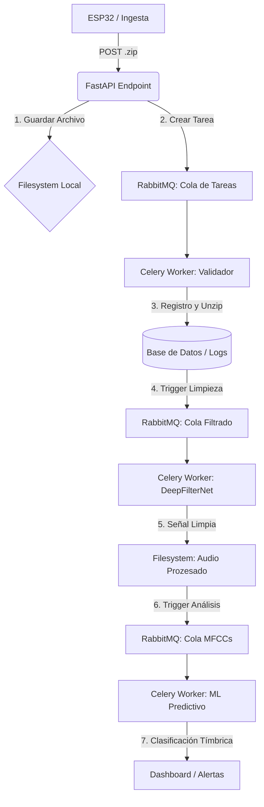

# Predictive Maintenance System (Acoustic Analysis & AI)

Este proyecto desarrolla una solución avanzada de **mantenimiento predictivo** mediante el monitoreo acústico de maquinaria en tiempo real. Utiliza Inteligencia Artificial para detectar anomalías y patrones de falla antes de que ocurran, optimizando los ciclos de reparación y reduciendo drásticamente los tiempos de inactividad industrial.

## 📋 Descripción General
El sistema captura señales de audio del funcionamiento de maquinaria industrial utilizando microcontroladores **ESP32**. Esta información se procesa en un servidor central que utiliza modelos de Deep Learning para aislar la señal de interés y diagnosticar el estado del equipo.

## 🛠️ Tech Stack & Arquitectura
El proyecto se basa en una infraestructura de procesamiento masivo no bloqueante, desacoplando totalmente la ingesta de datos del análisis analítico.

**Edge Computing:** Captura y envío asíncrono desde **ESP32** (MicroPython) con almacenamiento local en SD para redundancia.

**Backend (FastAPI):** Recepción asíncrona de datos y gestión de tareas.

**Broker de Mensajería (RabbitMQ):** Gestión de colas para asegurar la persistencia y el flujo de datos.

**Procesamiento (Celery Workers):** Ejecución en segundo plano de limpieza y análisis de audio.

**IA de Audio & Limpieza (DeepFilterNet):** Implementación de redes neuronales profundas para la reducción de ruido ambiental en tiempo real. A diferencia de los modelos musicales, este enfoque prioriza la preservación de la señal mecánica original, eliminando interferencias externas (voces, ventilación, ruido de fondo) sin alterar los armónicos críticos del motor.

**Extracción de Características (Librosa / PyAudioAnalysis):** Procesamiento de la señal limpia para obtener los **MFCCs** (Mel-Frequency Cepstral Coefficients). Estos coeficientes representan la "huella digital" tímbrica de la máquina, permitiendo que el sistema "entienda" variaciones sutiles en la vibración sonora.

**Clasificación Predictiva:** Uso de Redes Neuronales Convolucionales (CNN) o RNN que analizan la evolución de los MFCCs para clasificar el estado operativo entre "Normal" o "Anómalo" (Falla Inminente).

## 📊 Diagrama de Arquitectura de Tareas

## 🚀   Fases del Proyecto

**1-Fase Local (Conceptual):** Validación del pipeline de datos mediante simulación de ingesta en carpetas locales y análisis espectral básico.

**2-Fase Intermedia:** Implementación del patrón Worker-Queue para procesamiento paralelo de MFCCs y despliegue de DeepFilterNet.

**3-Fase Industrial:** Integración total con hardware ESP32, auditoría de dispositivos ("Heartbeat") y dashboard de alertas tempranas.

## ⚙️ Consideraciones de Ejecución

Sistema Operativo: Se recomienda el despliegue en Ubuntu para una gestión eficiente de los forks de procesos en Celery y sockets de RabbitMQ.

Configuración de Memoria: Es crítico limitar los procesos concurrentes de IA (Workers) para evitar desbordamientos de memoria (OOM) en entornos de recursos moderados.

# ⚖️ Licencia
Este proyecto está bajo la Apache License 2.0, proporcionando una estructura legal robusta para el uso comercial y protección de patentes en entornos industriales.